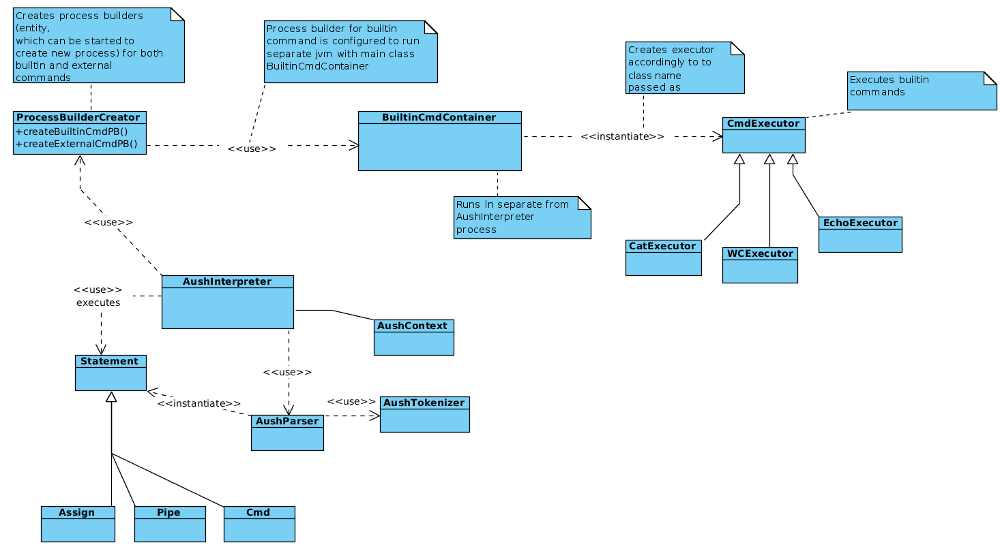

# AU Shell

## Patterns used

* Pattern *Command* used twice for builtin aush commands executors and for interpreter more abstract commands such as piped command or assign command
    - See `InterpreterCommand` interface and it's implementors: `AssignCommand`, `PipedCommand` and `SimpleCommand` in `ru.spbau.mit.aush.execute.cmd` package
* Pattern *Factory method* is used for creation of ProcessBuilders (they are used to run commands, passed to interpreter)
    - See `AushCmdProcessBuilderFactory` in `ru.spbau.mit.aush.execute.process` package
* Pattern *Visitor* used for variable substitution and other stuff on statement abstract tree
    - See package `ru.spbau.mit.aush.parse.visitor`
* Pattern *Composite* (almost) used in class hierarchy in `ru.spbau.mit.aush.parse.Statement` so `Statement.Pipe` is a composite of `Statement.Cmd`, which is `Statement` itself =)


## About

Pivotl tracker project: https://www.pivotaltracker.com/n/projects/1932763

That is simple REPL command interpreter. It supports basic built-in commands:
* cat
* echo
* wc
* exit
* pwd
* grep 

Also you can:

- Add variables like in sh: `X="value"` and use them also the same way: `$X` or `${X}`.
- Run external commands like `bash` of `ls` (use absolute path or put them in your path before)
- Construct piped commands like `echo HELLO | wc` to redirect output and input

## Build and run

* Run `./gradlew build` from project root directory to build project
* After build runnable jar will be available at `./build/libs` directory, so run it with `java -jar`

### Exaple session

```bash
aush >> /bin/ls
build
build.gradle
gradle
gradlew
gradlew.bat
README.md
settings.gradle
src
aush >> /bin/ls | wc
8 8 76
aush >> PRINT_MY_WORKING_DIRECTORY=pwd
aush >> ${PRINT_MY_WORKING_DIRECTORY}
/home/user/repos/au-bicycles/task1-shell
aush >> exit
```

## Class diagram sketch
